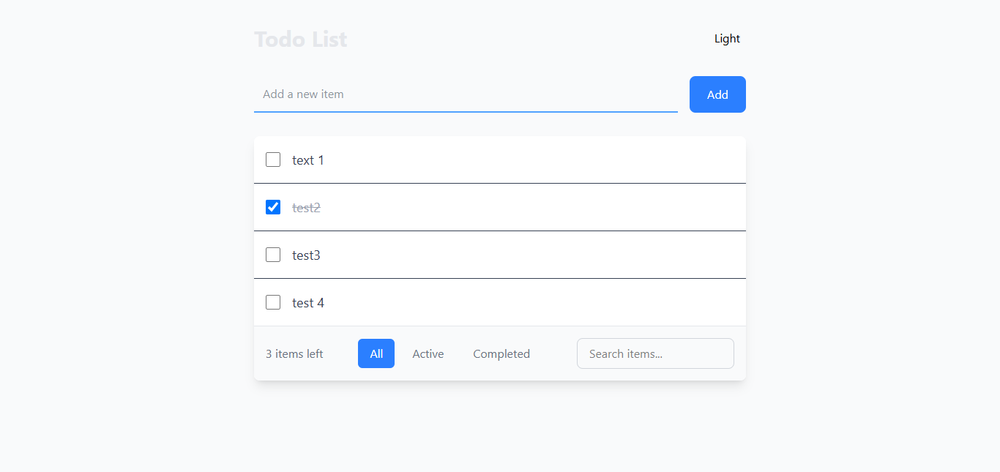
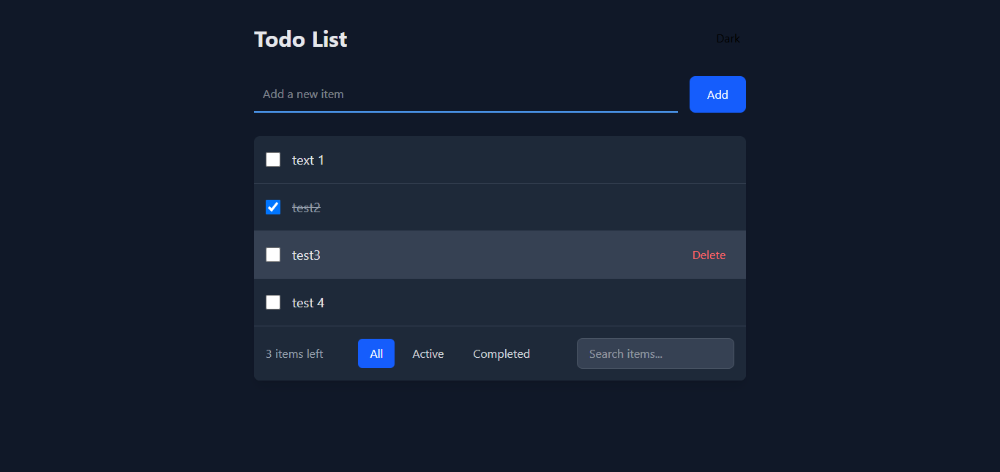
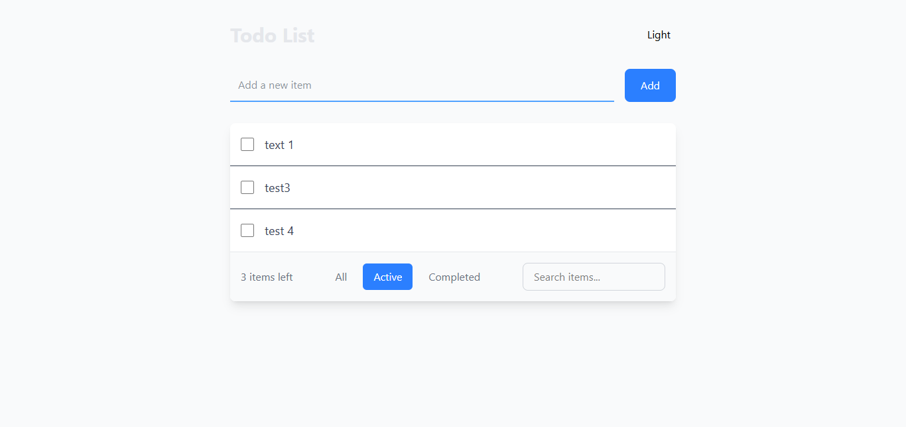
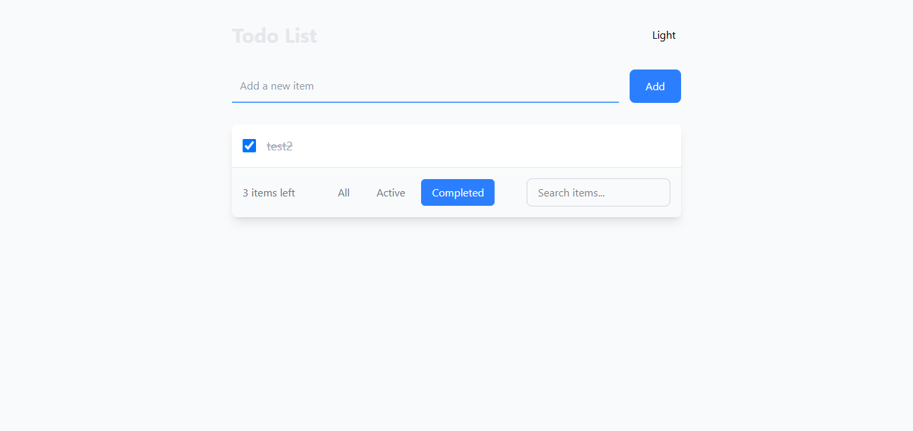
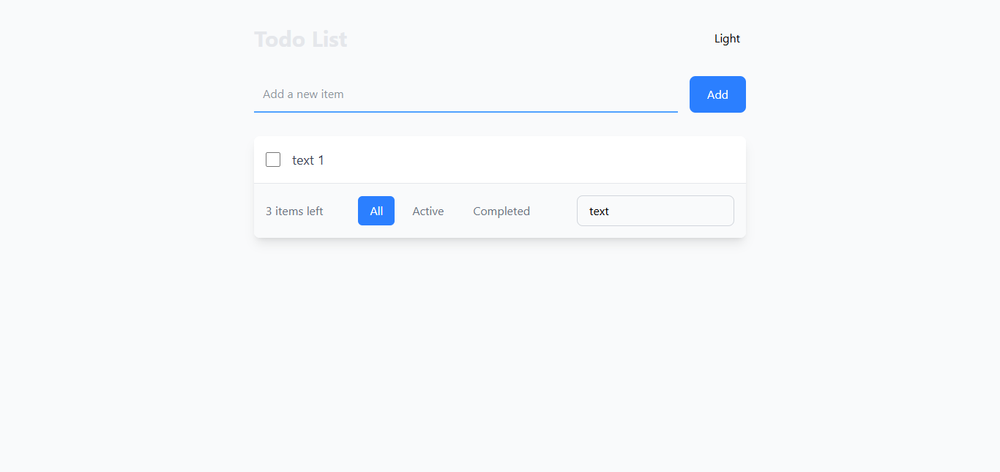

# toDoList 📝

A to do list system for adding your works on it

## Features ✨

 - Dark Mode
 - Filtering toDo items
 - Adding new items
 - Deleting Items
 - Searching Items

## preview 📷

<p align="left">
  <a href='https://github.com/arash-jj/ToDoList'>
    
  </a>
  <a href='https://github.com/arash-jj/ToDoList'>
    
  </a>
</p>

<p align="left">
  <a href='https://github.com/arash-jj/ToDoList'>
    
  </a>
  <a href='https://github.com/arash-jj/ToDoList'>
    
  </a>
</p>

<p align="center">
  <a href='https://github.com/arash-jj/ToDoList'>
    
  </a>
</p>

## Installation 💻
1. Clone the repository:
```bash
git clone https://github.com/arash-jj/ToDoList.git
